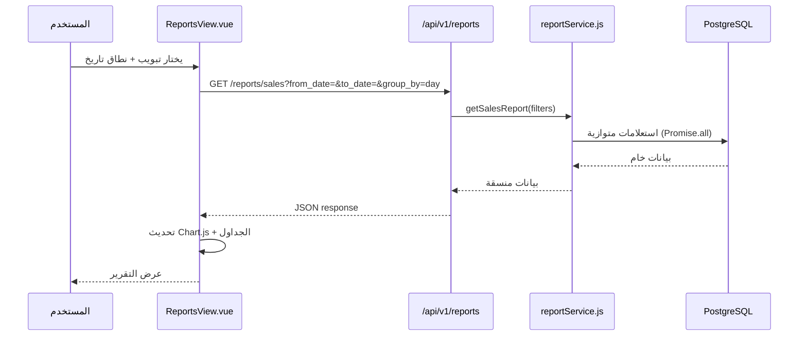
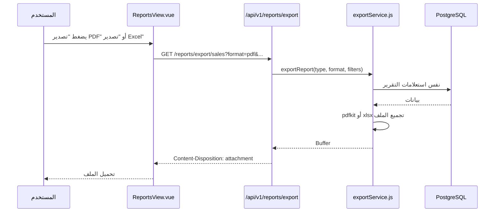

# وثيقة التصميم: قسم التقارير الشامل — بن العجوز ERP

## نظرة عامة

قسم التقارير الشامل هو مركز المعلومات الرئيسي في نظام بن العجوز ERP، يجمع بيانات جميع الأقسام (المبيعات، المخزون، المشتريات، المصروفات، العملاء، الموردين، التكاليف) في واجهة موحدة مع رسوم بيانية تفاعلية وإمكانية تصدير PDF/Excel.

القسم الحالي يعرض 5 تقارير بسيطة بدون رسوم بيانية ولا تصدير. التصميم الجديد يضيف 8 تقارير متخصصة مع لوحة KPIs، مقارنات زمنية، وتصدير متعدد الصيغ — كل ذلك فوق البنية التحتية الموجودة (Vue 3 + Chart.js + Express + PostgreSQL).

---

## المعمارية العامة

```mermaid
graph TD
    FE[ReportsView.vue\nVue 3 + Chart.js]
    API[/api/v1/reports/:type\nExpress Router]
    RS[reportService.js\nجديد - يجمع كل التقارير]
    US[userService.js\ngetReports موجود - يُوسَّع]
    DB[(PostgreSQL\nجداول موجودة)]
    EX[exportService.js\nجديد - PDF + Excel]

    FE -->|GET /reports/:type?params| API
    FE -->|GET /reports/export/:type| API
    API --> RS
    RS --> US
    RS --> DB
    API --> EX
    EX --> DB
```


---

## مخططات التسلسل للتدفقات الرئيسية





---

## المكونات والواجهات

### 1. Backend: reportService.js (جديد)

**الغرض**: تجميع كل منطق التقارير في service مستقل بدلاً من تضمينه في userService.js

```javascript
interface ReportFilters {
  from_date?: string    // YYYY-MM-DD
  to_date?: string      // YYYY-MM-DD
  group_by?: 'day' | 'week' | 'month'
  warehouse_id?: number
  category_id?: number
  supplier_id?: number
  customer_id?: number
  limit?: number
}

interface KPISummary {
  revenue: number           // إجمالي الإيرادات
  gross_profit: number      // الربح الإجمالي
  net_profit: number        // صافي الربح (بعد المصروفات)
  total_expenses: number    // إجمالي المصروفات
  sales_count: number       // عدد عمليات البيع
  avg_order_value: number   // متوسط قيمة الطلب
  top_products: ProductStat[]
  low_stock_count: number
  unpaid_invoices_amount: number
  customers_count: number
  period_comparison: PeriodComparison
}

interface SalesReport {
  summary: { total: number, profit: number, count: number, branch: number, wholesale: number }
  by_period: SalesPeriodRow[]   // مجمّع حسب يوم/أسبوع/شهر
  by_type: SalesTypeRow[]       // فرع vs جملة
  chart_data: ChartDataset
}

interface InventoryReport {
  total_value: number           // قيمة المخزون الكلية
  low_stock: ProductStock[]     // منتجات تحت الحد الأدنى
  by_warehouse: WarehouseStock[]
  movements_summary: MovementSummary[]
  top_moving: ProductStock[]    // الأكثر حركة
}

interface ProfitReport {
  by_product: ProductProfit[]   // هامش ربح لكل منتج
  by_category: CategoryProfit[] // هامش ربح لكل تصنيف
  trend: ProfitTrendRow[]       // اتجاه الربح عبر الزمن
}

interface CustomerReport {
  top_buyers: CustomerStat[]    // الأكثر شراءً
  debtors: CustomerDebt[]       // العملاء بديون
  total_receivables: number
  new_customers_count: number
}

interface PurchaseReport {
  by_supplier: SupplierPurchase[]
  by_period: PurchasePeriodRow[]
  total_amount: number
  top_suppliers: SupplierStat[]
}
```

**المسؤوليات**:
- تنفيذ استعلامات SQL المتخصصة لكل نوع تقرير
- تجميع البيانات من جداول متعددة بكفاءة (Promise.all)
- تنسيق البيانات لتناسب Chart.js مباشرة
- دعم التجميع الزمني (يومي/أسبوعي/شهري)

---

### 2. Backend: exportService.js (جديد)

**الغرض**: توليد ملفات PDF و Excel من بيانات التقارير

```javascript
interface ExportOptions {
  type: 'sales' | 'inventory' | 'profit' | 'expenses' | 'customers' | 'purchases' | 'summary'
  format: 'pdf' | 'excel'
  filters: ReportFilters
  title?: string
}

// الدوال الرئيسية
exportToPDF(options: ExportOptions): Promise<Buffer>
exportToExcel(options: ExportOptions): Promise<Buffer>
```

**المكتبات المستخدمة** (موجودة بالفعل في package.json):
- `pdfkit` — لتوليد PDF في الـ backend
- `xlsx` — لتوليد Excel في الـ backend

---

### 3. Frontend: ReportsView.vue (تطوير الموجود)

**الغرض**: الواجهة الرئيسية للتقارير مع تبويبات وفلاتر ورسوم بيانية

```javascript
// State الرئيسي
interface ReportsState {
  activeTab: ReportTab
  filters: ReportFilters
  loading: boolean
  error: string | null
  reportData: {
    kpi: KPISummary | null
    sales: SalesReport | null
    inventory: InventoryReport | null
    profit: ProfitReport | null
    expenses: ExpensesReport | null
    customers: CustomerReport | null
    purchases: PurchaseReport | null
  }
}

type ReportTab = 'kpi' | 'sales' | 'inventory' | 'profit' | 'expenses' | 'customers' | 'purchases'
```

**المكونات الفرعية**:
- `KpiDashboard.vue` — لوحة KPIs مع بطاقات الأرقام الرئيسية
- `SalesReportTab.vue` — تقرير المبيعات مع Chart.js
- `InventoryReportTab.vue` — تقرير المخزون
- `ProfitReportTab.vue` — تقرير التكاليف والأرباح
- `ExpensesReportTab.vue` — تقرير المصروفات
- `CustomersReportTab.vue` — تقرير العملاء
- `PurchasesReportTab.vue` — تقرير المشتريات
- `ReportExportBar.vue` — شريط التصدير PDF/Excel

---

## نماذج البيانات

### استعلام KPI الرئيسي

```sql
-- يُنفَّذ بـ Promise.all لتوازي الاستعلامات
SELECT
  COALESCE(SUM(total_amount), 0)  AS revenue,
  COALESCE(SUM(profit_amount), 0) AS gross_profit,
  COUNT(*)                         AS sales_count,
  COALESCE(AVG(total_amount), 0)  AS avg_order_value
FROM sales
WHERE deleted_at IS NULL
  AND status = 'completed'
  AND ($1::date IS NULL OR sale_date >= $1)
  AND ($2::date IS NULL OR sale_date <= $2);
```

### استعلام المبيعات مع التجميع الزمني

```sql
-- group_by = 'month'
SELECT
  DATE_TRUNC('month', sale_date) AS period,
  sale_type,
  COUNT(*)                        AS count,
  SUM(total_amount)               AS total,
  SUM(profit_amount)              AS profit,
  SUM(cost_amount)                AS cost
FROM sales
WHERE deleted_at IS NULL AND status = 'completed'
  AND ($1::date IS NULL OR sale_date >= $1)
  AND ($2::date IS NULL OR sale_date <= $2)
GROUP BY DATE_TRUNC('month', sale_date), sale_type
ORDER BY period DESC;
```

### استعلام قيمة المخزون

```sql
SELECT
  w.name_ar                              AS warehouse_name,
  COUNT(DISTINCT i.product_id)           AS products_count,
  SUM(i.quantity * p.purchase_price)     AS stock_value,
  SUM(i.quantity * p.sale_price)         AS retail_value
FROM inventory i
JOIN products p ON i.product_id = p.id
JOIN warehouses w ON i.warehouse_id = w.id
WHERE p.deleted_at IS NULL
GROUP BY w.id, w.name_ar
ORDER BY stock_value DESC;
```

### استعلام هامش الربح لكل منتج

```sql
SELECT
  p.name_ar,
  pc.name_ar                                          AS category_name,
  SUM(si.quantity)                                    AS total_sold,
  SUM(si.total_amount)                                AS revenue,
  SUM(si.cost_price)                                  AS total_cost,
  SUM(si.total_amount) - SUM(si.cost_price)           AS gross_profit,
  CASE WHEN SUM(si.total_amount) > 0
    THEN ROUND(
      (SUM(si.total_amount) - SUM(si.cost_price))
      / SUM(si.total_amount) * 100, 2)
    ELSE 0
  END                                                 AS margin_percent
FROM sale_items si
JOIN sales s ON si.sale_id = s.id
JOIN products p ON si.product_id = p.id
LEFT JOIN product_categories pc ON p.category_id = pc.id
WHERE s.deleted_at IS NULL AND s.status = 'completed'
  AND ($1::date IS NULL OR s.sale_date >= $1)
  AND ($2::date IS NULL OR s.sale_date <= $2)
GROUP BY p.id, p.name_ar, pc.name_ar
ORDER BY gross_profit DESC;
```

### استعلام العملاء الأكثر شراءً والديون

```sql
SELECT
  c.id, c.code, c.name_ar, c.phone,
  COUNT(s.id)           AS orders_count,
  SUM(s.total_amount)   AS total_purchased,
  c.balance             AS outstanding_debt
FROM customers c
LEFT JOIN sales s ON s.customer_id = c.id
  AND s.deleted_at IS NULL AND s.status = 'completed'
  AND ($1::date IS NULL OR s.sale_date >= $1)
  AND ($2::date IS NULL OR s.sale_date <= $2)
WHERE c.deleted_at IS NULL
GROUP BY c.id
ORDER BY total_purchased DESC NULLS LAST
LIMIT 50;
```

### استعلام المشتريات حسب المورد

```sql
SELECT
  s.id, s.name_ar AS supplier_name, s.phone,
  COUNT(pi.id)          AS invoices_count,
  SUM(pi.total_amount)  AS total_amount,
  MAX(pi.invoice_date)  AS last_purchase_date
FROM suppliers s
LEFT JOIN purchase_invoices pi ON pi.warehouse_id IS NOT NULL
  -- ملاحظة: purchase_invoices لا تحتوي supplier_id حالياً
  -- سيُضاف في migration جديد
WHERE s.deleted_at IS NULL
GROUP BY s.id, s.name_ar, s.phone
ORDER BY total_amount DESC NULLS LAST;
```

---

## الخوارزميات الرئيسية مع المواصفات الرسمية

### خوارزمية حساب صافي الربح

```pascal
ALGORITHM calculateNetProfit(filters)
INPUT: filters (from_date, to_date)
OUTPUT: netProfitSummary

PRECONDITIONS:
  - filters.from_date <= filters.to_date (إذا كلاهما موجود)
  - قاعدة البيانات متصلة

POSTCONDITIONS:
  - net_profit = gross_profit - total_expenses
  - جميع القيم غير سالبة أو سالبة بشكل صحيح

BEGIN
  [grossProfit, expenses] ← PARALLEL_EXECUTE(
    query("SELECT SUM(profit_amount) FROM sales WHERE ..."),
    query("SELECT SUM(amount) FROM expenses WHERE ...")
  )

  gross ← grossProfit.rows[0].total OR 0
  exp   ← expenses.rows[0].total OR 0
  net   ← gross - exp

  RETURN {
    gross_profit:    gross,
    total_expenses:  exp,
    net_profit:      net,
    profit_margin:   IF gross > 0 THEN (net / gross * 100) ELSE 0
  }
END
```

**Loop Invariants**: لا توجد حلقات — استعلامات SQL مجمّعة.

---

### خوارزمية التجميع الزمني للمبيعات

```pascal
ALGORITHM groupSalesByPeriod(rows, groupBy)
INPUT: rows (مصفوفة صفوف المبيعات الخام), groupBy ('day'|'week'|'month')
OUTPUT: grouped (مصفوفة مجمّعة)

PRECONDITIONS:
  - rows هي مصفوفة صحيحة (قد تكون فارغة)
  - groupBy ∈ {'day', 'week', 'month'}

POSTCONDITIONS:
  - ∀ row ∈ grouped: row.total = Σ(original rows في نفس الفترة).total
  - مرتبة تنازلياً حسب period

BEGIN
  truncFn ← MAP groupBy TO {
    'day'   → DATE_TRUNC('day', sale_date),
    'week'  → DATE_TRUNC('week', sale_date),
    'month' → DATE_TRUNC('month', sale_date)
  }

  -- يُنفَّذ في SQL مباشرة للكفاءة
  RETURN query(
    "SELECT " + truncFn + " as period,
     sale_type, COUNT(*), SUM(total_amount), SUM(profit_amount)
     FROM sales WHERE ... GROUP BY period, sale_type ORDER BY period DESC"
  )
END
```

---

### خوارزمية مقارنة الفترات (Period Comparison)

```pascal
ALGORITHM comparePeriods(currentFilters)
INPUT: currentFilters (from_date, to_date)
OUTPUT: comparison { current, previous, change_percent }

PRECONDITIONS:
  - from_date و to_date موجودان كلاهما

POSTCONDITIONS:
  - previous_period = نفس المدة الزمنية قبل current_period
  - change_percent = ((current - previous) / previous) * 100

BEGIN
  duration ← to_date - from_date  -- بالأيام

  prev_to   ← from_date - 1 day
  prev_from ← prev_to - duration days

  [current, previous] ← PARALLEL_EXECUTE(
    getSalesSummary(from_date, to_date),
    getSalesSummary(prev_from, prev_to)
  )

  FOR each metric IN [revenue, profit, expenses]:
    change ← current[metric] - previous[metric]
    IF previous[metric] > 0 THEN
      change_percent ← (change / previous[metric]) * 100
    ELSE
      change_percent ← IF change > 0 THEN 100 ELSE 0
    END IF
  END FOR

  RETURN { current, previous, changes }
END
```

---

## نقاط النهاية الجديدة في الـ API

```javascript
// إضافة إلى backend/src/routes/index.js

// تقارير موسّعة — تحل محل /reports/:type الحالية
router.get('/reports/kpi',        authenticate, authorize('reports.view'), api.reports.kpi)
router.get('/reports/sales',      authenticate, authorize('reports.view'), api.reports.sales)
router.get('/reports/inventory',  authenticate, authorize('reports.view'), api.reports.inventory)
router.get('/reports/profit',     authenticate, authorize('reports.view'), api.reports.profit)
router.get('/reports/expenses',   authenticate, authorize('reports.view'), api.reports.expenses)
router.get('/reports/customers',  authenticate, authorize('reports.view'), api.reports.customers)
router.get('/reports/purchases',  authenticate, authorize('reports.view'), api.reports.purchases)

// تصدير
router.get('/reports/export/:type', authenticate, authorize('reports.view'), api.reports.export)

// الـ route القديمة تبقى للتوافق مع الإصدارات السابقة
router.get('/reports/:type', authenticate, authorize('reports.view'), api.users.reports)
```

---

## معالجة الأخطاء

### سيناريو 1: نطاق تاريخ غير صحيح

**الشرط**: `from_date > to_date`
**الاستجابة**: `400 Bad Request` — "تاريخ البداية يجب أن يكون قبل تاريخ النهاية"
**التعافي**: الواجهة تعرض رسالة خطأ وتمنع الإرسال

### سيناريو 2: لا توجد بيانات في الفترة المحددة

**الشرط**: الاستعلام يعيد صفوفاً فارغة
**الاستجابة**: `200 OK` مع بيانات فارغة `{ data: [], summary: { total: 0, ... } }`
**التعافي**: الواجهة تعرض رسالة "لا توجد بيانات في هذه الفترة"

### سيناريو 3: فشل التصدير

**الشرط**: خطأ في توليد PDF/Excel
**الاستجابة**: `500 Internal Server Error` — "فشل إنشاء الملف"
**التعافي**: الواجهة تعرض رسالة خطأ مع زر إعادة المحاولة

### سيناريو 4: جدول purchase_invoices بدون supplier_id

**الشرط**: الجدول الحالي لا يحتوي على `supplier_id`
**الاستجابة**: تقرير المشتريات يعمل بدون ربط بالموردين حتى إضافة migration
**التعافي**: migration اختياري يُضاف لاحقاً

---

## استراتيجية الاختبار

### اختبارات الوحدة (Unit Tests)

- `calculateNetProfit` — التحقق من صحة الحسابات مع قيم حدية (صفر، سالب)
- `groupSalesByPeriod` — التحقق من التجميع الصحيح لكل نوع (day/week/month)
- `comparePeriods` — التحقق من حساب الفترة السابقة بشكل صحيح
- `exportToPDF` / `exportToExcel` — التحقق من إنتاج buffer غير فارغ

### اختبارات الخصائص (Property-Based Tests)

**المكتبة**: fast-check (متوافقة مع بيئة Node.js الموجودة)

```javascript
// خاصية 1: صافي الربح دائماً = إجمالي الربح - المصروفات
property: ∀ (grossProfit, expenses) ∈ ℝ≥0 × ℝ≥0:
  netProfit(grossProfit, expenses) = grossProfit - expenses

// خاصية 2: مجموع التجميع = مجموع الأصل
property: ∀ rows ∈ SalesRow[]:
  Σ(groupByPeriod(rows).map(r => r.total)) = Σ(rows.map(r => r.total))

// خاصية 3: هامش الربح دائماً بين -100% و 100% (أو أكثر في حالات خاصة)
property: ∀ (revenue, cost) ∈ ℝ≥0 × ℝ≥0, revenue > 0:
  marginPercent = (revenue - cost) / revenue * 100
  marginPercent ≤ 100

// خاصية 4: مقارنة الفترات — الفترة السابقة لا تتداخل مع الحالية
property: ∀ (from, to) ∈ Date × Date, from ≤ to:
  prevPeriod.to < from
```

### اختبارات التكامل (Integration Tests)

- GET `/reports/kpi` — يعيد بيانات صحيحة مع فلاتر التاريخ
- GET `/reports/sales?group_by=month` — يعيد بيانات مجمّعة شهرياً
- GET `/reports/export/sales?format=excel` — يعيد ملف Excel صالح
- GET `/reports/export/sales?format=pdf` — يعيد ملف PDF صالح

---

## اعتبارات الأداء

- **استعلامات متوازية**: استخدام `Promise.all` لتنفيذ الاستعلامات المستقلة معاً (موجود بالفعل في dashboardService.js)
- **فهارس موجودة**: `idx_sales_date`, `idx_expenses_date`, `idx_inventory_product` — كافية للتقارير
- **فهارس مقترحة إضافية**:
  ```sql
  CREATE INDEX IF NOT EXISTS idx_sales_type_date ON sales(sale_type, sale_date) WHERE deleted_at IS NULL;
  CREATE INDEX IF NOT EXISTS idx_sale_items_product ON sale_items(product_id);
  CREATE INDEX IF NOT EXISTS idx_purchase_invoices_date ON purchase_invoices(invoice_date) WHERE deleted_at IS NULL;
  ```
- **Pagination**: تقارير العملاء والمنتجات تدعم `limit` و `offset`
- **Cache**: لا يُطبَّق في هذه المرحلة — البيانات حساسة للوقت

---

## اعتبارات الأمان

- جميع نقاط النهاية محمية بـ `authenticate` + `authorize('reports.view')`
- فلاتر التاريخ تُمرَّر كـ parameterized queries (لا SQL injection)
- ملفات التصدير تُولَّد في الذاكرة (Buffer) ولا تُحفَّظ على القرص
- لا تُعرَّض بيانات المستخدمين الحساسة (كلمات المرور، tokens) في التقارير

---

## التبعيات

### موجودة بالفعل
- `pdfkit ^0.15.0` — توليد PDF في الـ backend
- `xlsx ^0.18.5` — توليد Excel في الـ backend
- `chart.js ^4.4.4` + `vue-chartjs ^5.3.1` — رسوم بيانية في الـ frontend
- `jspdf ^4.2.1` + `html2pdf.js ^0.14.0` — خيار بديل للـ PDF في الـ frontend

### تحتاج إضافة
- لا شيء — جميع المكتبات المطلوبة موجودة

### Migration مقترح (اختياري)
```sql
-- إضافة supplier_id لجدول purchase_invoices لربط المشتريات بالموردين
ALTER TABLE purchase_invoices ADD COLUMN IF NOT EXISTS supplier_id INT REFERENCES suppliers(id);
CREATE INDEX IF NOT EXISTS idx_purchase_invoices_supplier ON purchase_invoices(supplier_id);
```
