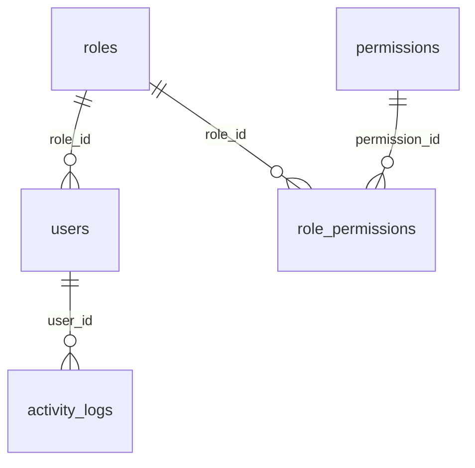
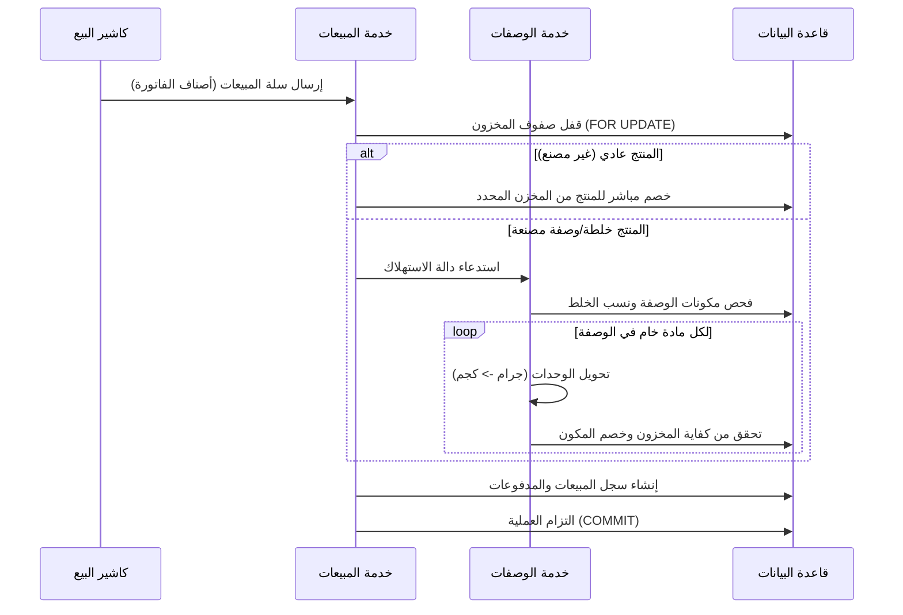

# التوثيق والتحليل الشامل لنظام بن العجوز ERP
(Comprehensive System & Algorithm Analysis)

هذا المستند يقدم تحليلاً تفصيلياً شاملاً لبنية الأكواد، الجداول، منطق العمل، والخوارزميات المستخدمة في نظام بن العجوز ERP لتسهيل الفهم البرمجي والرياضي لكل قسم.

---

## فهرس المحتويات
1. [إدارة الهوية والصلاحيات (Auth & Permissions)](#1-إدارة-الهوية-والصلاحيات-auth--permissions)
2. [إدارة المنتجات والوحدات (Products & Categories)](#2-إدارة-المنتجات-والوحدات-products--categories)
3. [المخازن وحركات المخزون (Inventory & Stock Movements)](#3-المخازن-وحركات-المخزون-inventory--stock-movements)
4. [المبيعات ونقاط البيع (Sales & POS)](#4-المبيعات-ونقاط-البيع-sales--pos)
5. [المشتريات وحسابات الموردين (Purchases & Suppliers)](#5-المشتريات-وحسابات-الموردين-purchases--suppliers)
6. [التركيبات واحتساب التكاليف (Recipes & Costs)](#6-التركيبات-واحتساب-التكاليف-recipes--costs)
7. [إدارة العملاء والائتمان (Customers & Credit)](#7-إدارة-العملاء-والائتمان-customers--credit)
8. [الموارد البشرية وحساب المرتبات (HR & Payroll)](#8-الموارد-البشرية-وحساب-المرتبات-hr--payroll)
9. [التقارير المالية والنسخ الاحتياطي (Financials & Backup)](#9-التقارير-المالية-والنسخ-الاحتياطي-financials--backup)

---

## 1. إدارة الهوية والصلاحيات (Auth & Permissions)

### أ. الهدف الوظيفي
تأمين النظام ضد الوصول غير المصرح به، وتوزيع الأدوار الوظيفية (Admin, Manager, Cashier, Warehouse) مع تطبيق نظام الصلاحيات الموجهة للمهام (Permission-Based Access Control).

### ب. هيكل قاعدة البيانات
* **`roles`**: يحتوي على الأدوار الرئيسية (مثل `admin` مدير، `cashier` كاشير).
* **`permissions`**: رموز الصلاحيات الفرعية (مثل `hr.manage`, `sales.pos`).
* **`role_permissions`**: جدول وسيط يربط الأدوار بالصلاحيات (علاقة Many-to-Many).
* **`users`**: بيانات حسابات الموظفين المرتبطة بدور معين `role_id` وكلمات مرور مشفرة بـ `bcrypt`.



### ج. منطق العمل والخوارزميات
1. **تشفير كلمات المرور**: يتم التحقق من كلمات المرور باستخدام خوارزمية `bcrypt`. كلمات المرور القديمة التي لا تبدأ بـ `$2` يتم إيقافها وإجبار المستخدم على تحديثها لحماية البيانات.
2. **توليد رمز JWT**: بعد مطابقة الاسم وكلمة المرور، يتم إصدار رمز JWT مشفر يحتوي على `userId` و `role` بصلاحية محددة.
3. **حماية مسارات API**:
   * **`authenticate` middleware**: يحلل رمز الـ JWT للتحقق من هوية المستخدم ونشاط حسابه.
   * **`authorize(...permissions)` middleware**: يتحقق مما إذا كان دور المستخدم يملك الصلاحية المطلوبة للوصول إلى هذا المسار.
   * **ملاحظة**: مستخدم الـ `admin` يتم استثناؤه تلقائياً ويمنح وصولاً كاملاً دون فحص جدول الصلاحيات لتوفير الأداء.
4. **حماية Brute-Force**: يتم وضع محدد للطلب (`rateLimit`) على مسار تسجيل الدخول يقيد المحاولات إلى **10 محاولات كحد أقصى كل 15 دقيقة** لتفادي هجمات التخمين.

### د. مسارات الـ API والملفات المعنية
* **الملفات المعنية**:
  * [authService.js](file:///d:/AlAgoouz%20System/AlAgoouz-erp/backend/src/services/authService.js)
  * [auth.js (middleware)](file:///d:/AlAgoouz%20System/AlAgoouz-erp/backend/src/middleware/auth.js)
* **المسارات**:
  * `POST /api/auth/login` -> تسجيل الدخول وإنشاء الرمز.
  * `GET /api/auth/profile` -> جلب بيانات الملف الشخصي.

---

## 2. إدارة المنتجات والوحدات (Products & Categories)

### أ. الهدف الوظيفي
إدارة المادة الخام (كحبوب البن الأخضر والمواد التشغيلية) والمنتجات النهائية (كالبن المعبأ والمشروبات).

### ب. هيكل قاعدة البيانات
* **`product_categories`**: تصنيف المنتجات (مثلاً: بن، مشروبات ساخنة، تعبئة وتغليف) مع إمكانية هيكلتها شجرياً (`parent_id`).
* **`products`**: يحتوي على تفاصيل المنتج:
  * الـ `sku`: رمز فريد مولد تلقائياً.
  * الـ `purchase_price`: سعر الشراء الأخير للمادة الخام.
  * الـ `sale_price` والـ `wholesale_price`: أسعار بيع التجزئة والجملة.
  * الـ `primary_warehouse_id`: المخزن الافتراضي للمنتج لضمان انسياب الحركات.

### ج. منطق العمل والخوارزميات
1. **توليد الـ SKU التلقائي**:
   يستخدم قفلاً استشارياً لقاعدة البيانات (`pg_advisory_xact_lock`) لمنع التكرار (Race Condition) عند إنشاء منتجين في نفس اللحظة. الخوارزمية تبحث عن أعلى رقم بنمط `AGoouz-XXX` وتضيف له 1.
2. **تحديث المخزن الرئيسي وإعادة توزيع الكميات**:
   * عند تعديل المخزن الرئيسي لمنتج معين، وإذا كان المنتج **لا يرتبط بوصفة تصنيع نشطة**، يتم تجميع كمياته بالكامل من كافة المستودعات السابقة ونقلها للمستودع الجديد.
   * خوارزمية التحديث:
     \[
     Q_{\text{new\_warehouse}} = \sum_{w \in W} Q_{w}
     \]
     حيث يتم إفراغ كافة السجلات السابقة في جدول `inventory` للمنتج وإدراج سجل وحيد بالكمية المجمعة في المخزن الجديد منعاً لتشتت مخزون المنتجات الأساسية.

### د. مسارات الـ API والملفات المعنية
* **الملفات المعنية**:
  * [productService.js](file:///d:/AlAgoouz%20System/AlAgoouz-erp/backend/src/services/productService.js)
* **المسارات**:
  * `GET /api/products` -> قائمة المنتجات مع تصفية متقدمة.
  * `POST /api/products` -> إنشاء منتج جديد مع مخزون افتتاحي.
  * `PUT /api/products/:id` -> تحديث بيانات منتج (يتضمن خوارزمية دمج المخزون).
  * `POST /api/products/import` -> استيراد المنتجات من ملف Excel.

---

## 3. المخازن وحركات المخزون (Inventory & Stock Movements)

### أ. الهدف الوظيفي
تتبع كميات البضائع داخل المستودعات المختلفة (المحل، المخزن الرئيسي، إلخ)، وضبط حركتها بدقة وشفافية.

### ب. هيكل قاعدة البيانات
* **`warehouses`**: فروع المستودعات والمحلات.
* **`inventory`**: كمية كل منتج داخل كل مخزن مع ربطها بالـ `batch_number` وتاريخ الصلاحية.
* **`stock_movements`**: سجل تاريخي غير قابل للتعديل لكافة حركات الدخول والخروج والتحويل المخزني.

### ج. منطق العمل والخوارزميات
1. **التحقق من المنتجات المصنعة (Recipes)**:
   يُمنع منعاً باتاً تعديل كمية المخزون يدوياً أو إجراء تسوية مخزنية (Adjustment) أو تحويل (Transfer) لمنتج يرتبط بوصفة تصنيع نشطة. مخزون هذه المنتجات يتم التحكم به حصرياً عبر أوامر الإنتاج والبيع (من خلال سحب المواد الخام).
2. **آلية قفل الصفوف (Row Locking)**:
   لتفادي التعارض عند البيع والشراء المتزامن، يتم استدعاء `lockInventoryRow` والتي تنفذ استعلام `SELECT FOR UPDATE` على السجل المعني في المخزن. إذا لم يكن السجل موجوداً، تقوم بإنشائه بصفة مبدئية بكمية صفرية ثم قفله.
3. **التسوية والتحويل**:
   * **التحويل**: يخصم من المصدر ويضيف للمستهدف بعد التحقق من كفاية الكمية في المصدر.
   * **التسوية**: تحسب الفارق (Delta) بين الكمية الفعلية والكمية المدخلة وتنشئ حركة مخزون بالقيمة المطلقة للفارق وتحدد الاتجاه (دخل/خرج) بناءً على إشارة الفارق:
     \[
     \Delta = Q_{\text{target}} - Q_{\text{current}}
     \]

```
  إذا كان Delta > 0: حركة دخول (In) للمخزن
  إذا كان Delta < 0: حركة خروج (Out) من المخزن
```

### د. مسارات الـ API والملفات المعنية
* **الملفات المعنية**:
  * [inventoryService.js](file:///d:/AlAgoouz%20System/AlAgoouz-erp/backend/src/services/inventoryService.js)
* **المسارات**:
  * `GET /api/inventory` -> عرض حالة المخزون الحالية وتنبيهات النواقص.
  * `POST /api/inventory/transfer` -> تحويل كميات بين مستودعين.
  * `POST /api/inventory/adjust` -> تسوية كمية منتج يدوياً.

---

## 4. المبيعات ونقاط البيع (Sales & POS)

### أ. الهدف الوظيفي
تسجيل عمليات البيع اليومية للفرع والبيع بالجملة، وتحديث الأرصدة وتوليد الفواتير وضمان صحة خصم المواد الخام.

### ب. هيكل قاعدة البيانات
* **`sales`**: رأس الفاتورة ويحتوي على الإجماليات، نوع البيع (POS، فرع، جملة)، التكلفة الإجمالية وصافي الربح.
* **`sale_items`**: تفاصيل الفاتورة (المنتج، الكمية، سعر البيع، سعر التكلفة الفعلي وقت البيع).
* **`invoices`**: الفاتورة الضريبية أو المبسطة المرتبطة بعملية البيع.
* **`payments`**: سجل الدفعات المسددة للفاتورة.

### ج. منطق العمل والخوارزميات
1. **احتساب الإجماليات ووقف حساب الضريبة**:
   * يتم احتساب إجمالي الفاتورة، خصم الخصومات على مستوى الصنف أو الفاتورة.
   * الضريبة تم ضبط قيمتها برمجياً إلى **صفر** (موقوفة مؤقتاً لتسهيل حسابات الشركة حالياً).
2. **خوارزمية تحديد مخزن البيع التلقائي (`resolveSaleWarehouseId`)**:
   عند فحص أصناف الفاتورة:
   * إذا كانت جميع أصناف الفاتورة تملك نفس المخزن الرئيسي الافتراضي، يتم استخدام هذا المخزن للعملية.
   * إذا لم يكن لها مخزن رئيسي، يتم فحص جدول المخزون وتحديد المخزن الذي يحتوي على أكبر كمية متوفرة لتلك المنتجات.
   * في حال تشعب المنتجات بين مخازن رئيسية مختلفة، يرفض النظام الفاتورة ويطالب بفصل الفواتير أو تحديد مخزن موحد.
3. **خوارزمية استهلاك المكونات الخام عند بيع الخلطات (Recipe Consumption)**:
   * عند بيع صنف، يتم التحقق مما إذا كان مرتبطاً بوصفة نشطة (خلطة بن مثلاً).
   * إذا وجد له وصفة، لا يتم خصم المنتج نفسه من المخزون، بل يتم فك مكونات الوصفة وخصم كل مادة خام بالكمية النسبية المطلوبة:
     \[
     Q_{\text{consumed\_ingredient}} = Q_{\text{recipe\_item}} \times Q_{\text{sold\_product}}
     \]
   * يقوم النظام بعمل تحويل للوحدات (مثلاً: جرام إلى كيلوجرام) لضمان الخصم بالوحدة المخزنة الفعالة.
   * إذا كان أي مكون خام لا يكفي لإتمام العملية، يتم التراجع عن العملية (Transaction Rollback) بالكامل وإظهار رسالة نقص المادة الخام المحددة للمستخدم.



### د. مسارات الـ API والملفات المعنية
* **الملفات المعنية**:
  * [salesService.js](file:///d:/AlAgoouz%20System/AlAgoouz-erp/backend/src/services/salesService.js)
  * [recipesService.js](file:///d:/AlAgoouz%20System/AlAgoouz-erp/backend/src/services/recipesService.js)
* **المسارات**:
  * `POST /api/sales` -> إنشاء فاتورة بيع جديدة وتفعيل خوارزمية الخصم والتركيبات.
  * `PUT /api/sales/:id` -> تعديل فاتورة بيع.
  * `POST /api/sales/:id/return` -> إرجاع فاتورة (يعيد المخزون للمكونات أو المنتجات).

---

## 5. المشتريات وحسابات الموردين (Purchases & Suppliers)

### أ. الهدف الوظيفي
تسجيل الفواتير الواردة من الموردين وتحديث كميات المخزون وتكلفة المنتجات وإدارة التزامات الموردين.

### ب. هيكل قاعدة البيانات
* **`purchase_invoices`**: بيانات الفاتورة الرئيسية (المورد، الإجمالي، التاريخ).
* **`purchase_invoice_items`**: الأصناف المشتراة، الكميات وأسعار الشراء.
* **`suppliers`**: بيانات الموردين وأرقام التواصل.

### ج. منطق العمل والخوارزميات
1. **تحديث سعر الشراء الفعلي**:
   بمجرد إتمام عملية شراء لمنتج ما، يقوم النظام بتحديث الحقل `purchase_price` في جدول `products` فوراً ليعكس **آخر سعر شراء**. هذا السعر يعتبر الأساس في حساب تكلفة الخلطات مستقبلاً.
2. **منع شراء المنتجات المصنعة**:
   يمنع النظام شراء أي منتج يرتبط بوصفة تصنيع نشطة. المنتجات المصنعة تدخل المخزن فقط عبر الإنتاج أو مبيعات المرتجعات، ولا يمكن إدراجها في فواتير شراء الموردين.
3. **عكس المشتريات (Reversal Logic)**:
   عند تعديل فاتورة شراء أو إلغائها، يطبق النظام خوارزمية سحب أمان:
   * يتحقق من كمية المخزون الحالية للمنتج في المستودع.
   * يتم خصم الكميات الملغاة بحد أقصى الكمية المتاحة.
   * إذا بيعت البضاعة بالفعل وأصبح المخزون غير كافٍ لعكس الفاتورة بالكامل، يتم خصم المتاح وتسجيل العجز المتبقي كـ (Shortage) لتنبيه المسؤول لاتخاذ إجراء تسوية يدوي.

### د. مسارات الـ API والملفات المعنية
* **الملفات المعنية**:
  * [purchaseService.js](file:///d:/AlAgoouz%20System/AlAgoouz-erp/backend/src/services/purchaseService.js)
  * [supplierService.js](file:///d:/AlAgoouz%20System/AlAgoouz-erp/backend/src/services/supplierService.js)
* **المسارات**:
  * `POST /api/purchases` -> إنشاء فاتورة شراء جديدة (يحدث المخزون وسعر الشراء الأخير).
  * `PUT /api/purchases/:id` -> تعديل فاتورة الشراء وعكس الكميات القديمة.

---

## 6. التركيبات واحتساب التكاليف (Recipes & Costs)

### أ. الهدف الوظيفي
تعريف خلطات البن (التركيبات) واحتساب تكاليفها الفعلية بناءً على مكوناتها الخام لتحديد أسعار بيع عادلة وحساب الأرباح بدقة.

### ب. هيكل قاعدة البيانات
* **`product_recipes`**: ترويسة الخلطة وتحدد المنتج النهائي ونمط الإنتاج.
* **`product_recipe_items`**: مكونات الخلطة (المواد الخام) ونسبها (بالجرام أو الكيلو أو العدد).

### ج. منطق العمل والخوارزميات
1. **خوارزمية احتساب التكلفة التقديرية الذكية (Recursive Effective Cost)**:
   لحساب التكلفة الحقيقية لمنتج معين (سواء كان مادة خام مباشرة أو منتجاً مصنعاً يتكون من خلطات أخرى داخل بعضها):
   * يستدعي النظام الدالة `resolveEffectiveCostRecursive` والتي تعمل بطريقة العودية (Recursion) مع آلية منع الدوران اللانهائي (Circular Dependency Cache/Stack).
   * **خطوات الخوارزمية**:
     1. إذا كان المنتج لا يملك وصفة تصنيع، تكون تكلفته هي سعر الشراء المباشر له:
        \[
        C_{\text{product}} = P_{\text{purchase}}
        \]
     2. إذا كان المنتج مصنعاً (له وصفة):
        يقوم النظام بالدخول إلى كل مكون في الوصفة وحساب تكلفته عودياً، ثم تحويل وحدته إلى وحدة الوصفة:
        \[
        C_{\text{item}} = \text{unitPriceFor}(C_{\text{ingredient}}, U_{\text{ingredient}}, U_{\text{recipe}})
        \]
        ثم تجميع تكلفة كافة المكونات مضروبة في كمياتها:
        \[
        C_{\text{recipe}} = \sum (Q_{\text{item}} \times C_{\text{item}})
        \]
     3. في حال فشل احتساب تكلفة الوصفة (تساوي صفر) وكان للمنتج سعر شراء مسجل، يتم اعتماده كبديل احتياطي (Fallback).
     4. يتم تخزين الناتج في ذاكرة مؤقتة (Cache Map) لتجنب تكرار العمليات الحسابية وتحسين استجابة الخادم.

```
خوارزمية حساب التكلفة العودية (Pseudocode):

function getEffectiveCost(productId, cache, stack):
  if productId in cache: return cache[productId]
  if productId in stack: throw "Circular Dependency Detected"
  
  stack.add(productId)
  let baseProduct = getProduct(productId)
  let recipeItems = getRecipeItems(productId)
  
  if recipeItems.isEmpty():
    return baseProduct.purchase_price
    
  let totalCost = 0
  for item in recipeItems:
    let ingredientCost = getEffectiveCost(item.ingredient_id, cache, stack)
    let unitCost = convertUnit(ingredientCost, item.ingredient_unit, item.recipe_unit)
    totalCost += item.quantity * unitCost
    
  stack.delete(productId)
  cache[productId] = totalCost
  return totalCost
```

2. **أنماط الإنتاج المتاحة**:
   * **الإنتاج الفوري (On-the-fly)**: يتم خصم المواد الخام مباشرة وقت بيع المنتج في الكاشير (مثال: فنجان قهوة محضر فوراً).
   * **الإنتاج المخزن (Stocked Production)**: يتم تصنيع كميات مسبقة (مثل طحن وتعبئة كيلو بن وضعه في الرف)؛ هنا يمنع النظام إنتاج الصنف إلا إذا كان يملك **مخزناً رئيسياً افتراضياً** لتخزين المنتج النهائي فيه بعد سحب الخامات.

### د. مسارات الـ API والملفات المعنية
* **الملفات المعنية**:
  * [productCostService.js](file:///d:/AlAgoouz%20System/AlAgoouz-erp/backend/src/services/productCostService.js)
  * [recipesService.js](file:///d:/AlAgoouz%20System/AlAgoouz-erp/backend/src/services/recipesService.js)
* **المسارات**:
  * `GET /api/products/costs-report` -> تقرير تكاليف المنتجات الفعلي والهوامش الربحية التقديرية.
  * `POST /api/recipes` -> إنشاء تركيب/وصفة لمنتج.

---

## 7. إدارة العملاء والائتمان (Customers & Credit)

### أ. الهدف الوظيفي
تتبع مبيعات العملاء (خصوصاً عملاء الجملة) وحدود الائتمان ومدفوعاتهم الآجلة.

### ب. هيكل قاعدة البيانات
* **`customers`**: بيانات العميل (الاسم، كود العميل، حد الائتمان الأقصى المسموح).
* **`customer_balances`**: جدول وسيط لتتبع الأرصدة الحالية.

### ج. منطق العمل والخوارزميات
1. **التحقق من حد الائتمان (Credit Limit Validation)**:
   عند إنشاء فاتورة بيع آجل (`payment_status = 'unpaid'` أو `'partial'`) لعميل جملة، يتم احتساب المديونية الجديدة وضمان عدم تجاوزها لحد الائتمان المسجل للعميل:
   \[
   \text{Outstanding} = \text{InvoiceTotal} - \text{PaidAmount}
   \]
   \[
   \text{NewBalance} = \text{CurrentBalance} + \text{Outstanding}
   \]
   إذا كانت المديونية الجديدة تفوق الحد الائتماني المعتمد للعميل، يرفض النظام حفظ الفاتورة حماية لأموال المؤسسة.
2. **إعادة احتساب الرصيد دورياً**:
   عند كل عملية سداد أو بيع أو مرتجع، يتم تشغيل دالة `recalculateCustomerBalance` التي تجمع كافة الفواتير والمدفوعات الخاصة بالعميل من قاعدة البيانات مباشرة لتحديث الرصيد الفعلي في سجل العميل لضمان الشفافية التامة.

### د. مسارات الـ API والملفات المعنية
* **الملفات المعنية**:
  * [customerService.js](file:///d:/AlAgoouz%20System/AlAgoouz-erp/backend/src/services/customerService.js)
  * [customerBalanceService.js](file:///d:/AlAgoouz%20System/AlAgoouz-erp/backend/src/services/customerBalanceService.js)
* **المسارات**:
  * `GET /api/customers` -> كشف بالعملاء وأرصدتهم الحالية.
  * `POST /api/customers` -> إضافة عميل وضبط حد الائتمان.

---

## 8. الموارد البشرية وحساب المرتبات (HR & Payroll)

### أ. الهدف الوظيفي
تسجيل حضور الموظفين وغيابهم، وتتبع السلف الممنوحة لهم، واحتساب الرواتب الشهرية والخصومات بطريقة دقيقة ومؤتمتة.

### ب. هيكل قاعدة البيانات
* **`employee_shifts`**: أوقات العمل الرسمية وساعات التأخير المسموح بها (Grace Minutes).
* **`employees`**: تفاصيل التعيين، نوع الراتب (شهري، يومي، ساعي)، قيمة الراتب الأساسي، وسعر الساعة الإضافية.
* **`employee_attendance`**: الحضور اليومي وساعات العمل والتأخير والعمل الإضافي.
* **`employee_advances`**: السلف الممنوحة وعدد الأقساط وقيمة القسط الشهري.
* **`payroll_runs`**: مسيرات المرتبات الشهرية (تبدأ كمسودة `draft` وتتحول إلى مصروف مدفوع `paid`).
* **`payroll_items`**: تفاصيل المرتب لكل موظف لشهر معين.

### ج. منطق العمل والخوارزميات
1. **خوارزمية احتساب كشف المرتبات الفردي**:
   لكل موظف مسجل ونشط، يتم احتساب البنود التالية:
   * **معدل اليومية ومعدل الساعة**:
     * إذا كان الموظف براتب يومي:
       \[
       \text{DailyRate} = \text{BaseSalary}
       \]
     * إذا كان براتب شهري (يتم التقسيم على عدد أيام العمل المقررة في الشهر، الافتراضي 26 يوماً):
       \[
       \text{DailyRate} = \frac{\text{BaseSalary}}{\text{WorkDaysPerMonth}}
       \]
     * معدل الساعة للموظف ذي الراتب الشهري/اليومي:
       \[
       \text{HourlyRate} = \frac{\text{DailyRate}}{\text{DailyRequiredHours}}
       \]
   * **الإضافي (Overtime)**:
     يُحسب من مجموع ساعات الإضافي في جدول الحضور مضروباً في سعر الساعة الإضافية الخاص بالموظف (أو معدل الساعة العادي إذا لم يحدد سعر خاص):
     \[
     \text{OvertimeAmount} = \text{OvertimeHours} \times \text{OvertimeRate}
     \]
   * **استقطاع الغياب (Absence Deduction)**:
     يطبق فقط على موظفي الراتب الشهري، ويحسب بخصم الأيام التي لم يحضر فيها الموظف عن أيام العمل المستهدفة:
     \[
     \text{AbsenceDeduction} = (\text{WorkDaysPerMonth} - \text{WorkedDays}) \times \text{DailyRate}
     \]
   * **استقطاع التأخير (Late Deduction)**:
     يُحسب بناءً على إجمالي دقائق التأخير التراكمية في الشهر بعد تخطي فترة السماح الخاصة بالشيفت:
     \[
     \text{LateDeduction} = \frac{\text{LateMinutes}}{60} \times \text{HourlyRate}
     \]
   * **استقطاع السلف (Advance Deduction)**:
     يفحص النظام السلف النشطة ويخصم قيمة القسط الشهري المستحق تلقائياً، بما لا يتجاوز الرصيد المتبقي من السلفة.
   * **صافي المرتب (Net Salary)**:
     يُجمع الراتب الأساسي مع الإضافي ويُطرح منه كافة الاستقطاعات:
     \[
     \text{GrossSalary} = \text{BaseSalary} (\text{or WorkedDays} \times \text{DailyRate}) + \text{OvertimeAmount}
     \]
     \[
     \text{NetSalary} = \max(0, \text{GrossSalary} - \text{AbsenceDeduction} - \text{LateDeduction} - \text{AdvanceDeduction})
     \]

2. **دورة حياة مسير المرتبات وتوليد المصروفات**:
   * **حالة المسودة (`draft`)**: يمكن تعديلها وإعادة احتسابها مراراً بناءً على تحديثات الحضور.
   * **حالة الصرف والإغلاق (`pay`)**:
     * عند الدفع، يتحول المسير إلى `paid` ويقفل ضد التعديل.
     * **توليد المصروف التلقائي**: يقوم النظام بإنشاء سجل مصروفات تلقائي في جدول `expenses` تحت تصنيف "المرتبات" بقيمة صافي الرواتب الإجمالي لخصمها من أرباح المؤسسة.
     * **تحديث السلف**: يتم استدعاء دالة `applyAdvanceDeductions` لتخفيض أرصدة السلف المفتوحة للموظفين بمقدار ما تم استقطاعه في كشف المرتبات، وإغلاق السلفة تماماً (`status = 'closed'`) إذا تم سدادها بالكامل.

### د. مسارات الـ API والملفات المعنية
* **الملفات المعنية**:
  * [hrService.js](file:///d:/AlAgoouz%20System/AlAgoouz-erp/backend/src/services/hrService.js)
* **المسارات**:
  * `GET /api/hr/payroll/preview` -> معاينة كشف المرتبات للشهر قبل اعتماده.
  * `POST /api/hr/payroll` -> إنشاء مسودة مسير المرتبات.
  * `POST /api/hr/payroll/:id/pay` -> صرف مسير المرتبات وتحديث السلف وتوليد المصروف التشغيلي.

---

## 9. التقارير المالية والنسخ الاحتياطي (Financials & Backup)

### أ. الهدف الوظيفي
استخراج كشوف الأرباح والخسائر وحالة التدفق النقدي، وحفظ بيانات النظام بصفة دورية لمنع الفقد.

### ب. هيكل قاعدة البيانات
* **`expenses`**: المصروفات الإدارية والتشغيلية العامة.
* **`settings`**: يُسخدم لتخزين بيانات النسخ الاحتياطي والترقيم المتسلسل ورصيد أول المدة المعتمد.

### ج. منطق العمل والخوارزميات
1. **معادلات تقرير الأرباح والخسائر (Profit & Loss)**:
   * **صافي الإيرادات**: إجمالي قيمة مبيعات الفواتير المكتملة مطروحاً منها مرتجعات المبيعات:
     \[
     \text{NetRevenue} = \text{GrossRevenue} - \text{Returns}
     \]
   * **تكلفة البضاعة المباعة (COGS basis)**:
     يستخدم النظام آلية ذكية ثلاثية الطبقات لتحديد تكلفة البضاعة:
     * **الطبقة الأولى (الأكثر دقة)**: تجميع حقل `cost_amount` المخزن مباشرة في سجلات البيع وقت الفاتورة (يغطي مبيعات الـ POS والمبيعات اليومية).
     * **الطبقة الثانية (الاحتياطية)**: تجميع قيمة الأصناف المباعة ضرب سعر تكلفة مكوناتها الفعلي من جدول `sale_items`.
     * **الطبقة الثالثة (التقريبية)**: في حال غياب بيانات التكلفة في المبيعات، يتم استخدام مجموع فواتير الشراء في نفس الفترة كتقريب لتكلفة البضاعة.
   * **هامش الربح الإجمالي**:
     \[
     \text{GrossProfit} = \text{NetRevenue} - \text{COGS}
     \]
   * **صافي الربح**:
     \[
     \text{NetProfit} = \text{GrossProfit} - \text{TotalExpenses}
     \]
     حيث تشمل المصروفات جميع المصاريف المسجلة بما فيها الرواتب المدفوعة.
   * **التدفق النقدي (Cash Flow)**:
     يحسب السيولة النقدية الفعلية بناءً على المدفوعات والمقبوضات الحقيقية:
     \[
     \text{CashFlow} = \text{OpeningBalance} + \text{Revenue} - \text{Purchases} - \text{Expenses}
     \]

2. **خوارزمية النسخ الاحتياطي التلقائي (Auto Backup Scheduler)**:
   * عند تشغيل خادم النظام، يتم تفعيل دالة `initAutoBackupScheduler`.
   * يتم أخذ نسخة احتياطية فورية أولى بعد 5 ثوانٍ من تشغيل الخادم.
   * تتم جدولة عملية نسخ احتياطي دورية **كل 4 ساعات** دون توقف.
   * **إدارة المساحة (Cleanup Algorithm)**:
     للحفاظ على مساحة القرص الصلب، يفحص النظام مجلد النسخ الاحتياطية دورياً ويفرزها تاريخياً، ثم يبقي على **آخر 30 نسخة احتياطية فقط** ويقوم بحذف النسخ الأقدم تلقائياً.

### د. مسارات الـ API والملفات المعنية
* **الملفات المعنية**:
  * [plService.js](file:///d:/AlAgoouz%20System/AlAgoouz-erp/backend/src/services/plService.js)
  * [autoBackupService.js](file:///d:/AlAgoouz%20System/AlAgoouz-erp/backend/src/services/autoBackupService.js)
* **المسارات**:
  * `GET /api/reports/profit-loss` -> جلب كشف الأرباح والخسائر والتدفقات النقدية للفترة المحددة.
  * `POST /api/settings/backup` -> إجراء نسخ احتياطي يدوي فوري.

---
> [!IMPORTANT]
> تم إعداد وتحديث هذا المستند التوضيحي بالكامل باللغة العربية ليتطابق تماماً مع الأكواد وقاعدة البيانات الحالية في بيئة عمل **بن العجوز ERP**.
